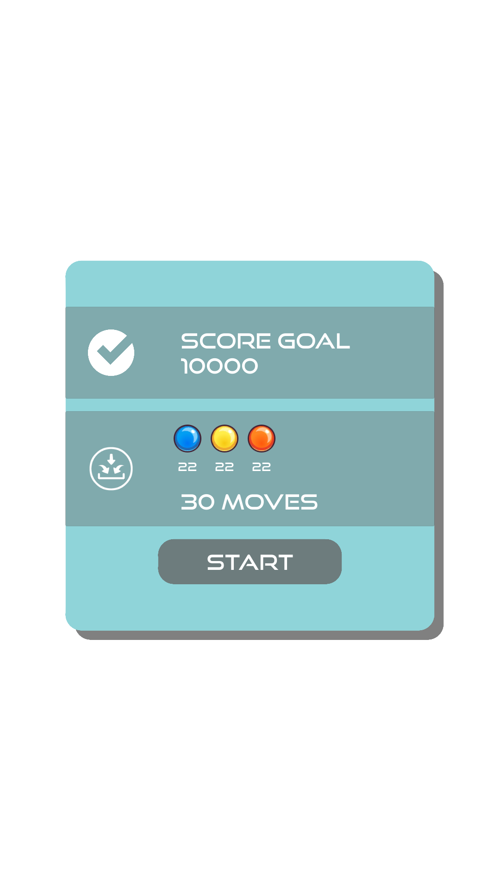
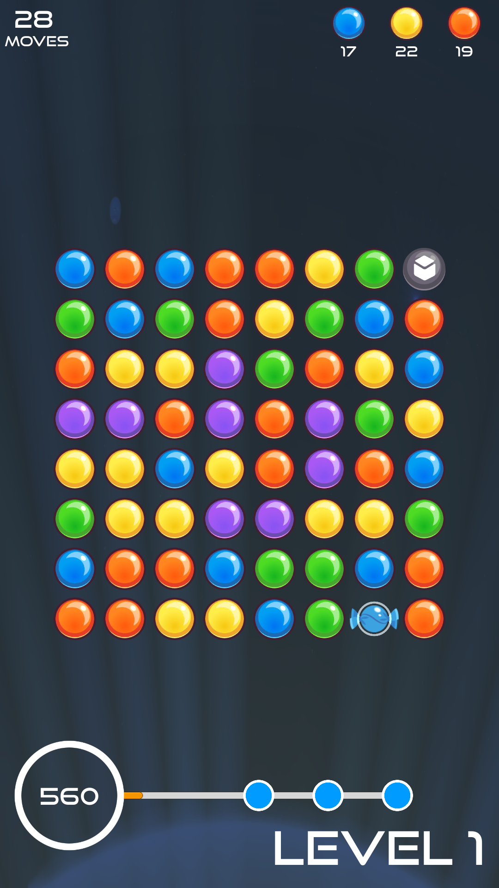
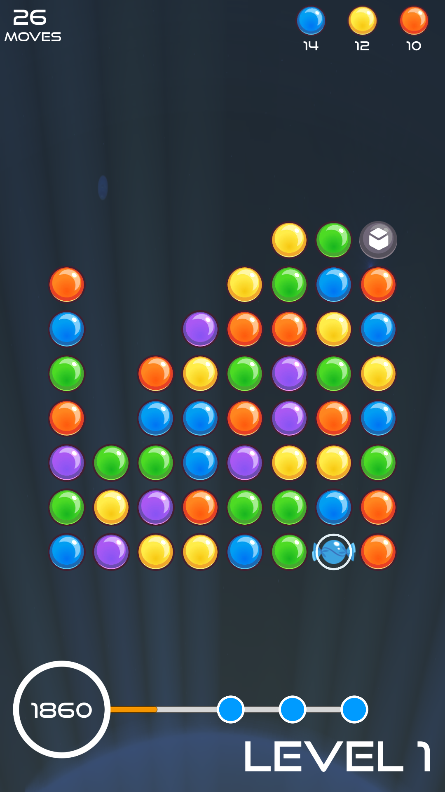
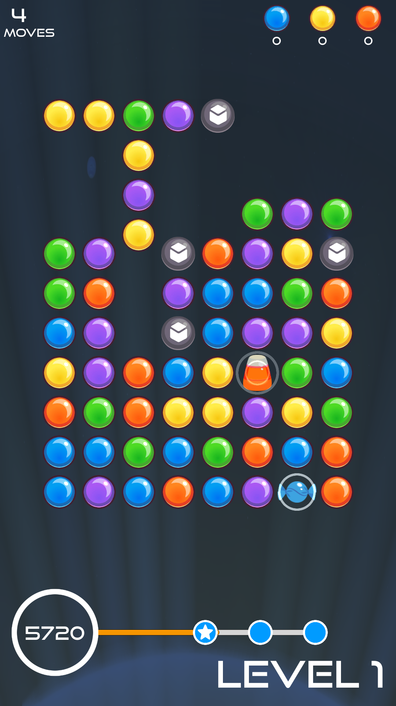
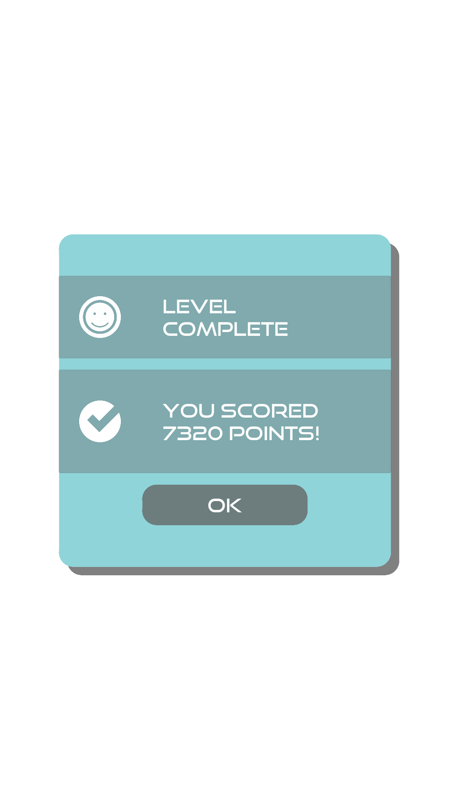

# A match-three puzzle game

A match-three puzzle game in Unity created under Wilmer Lin's [course](https://www.udemy.com/course/make-a-puzzle-match-game-in-unity/).

## Available game pieces

-  row bomb - destroys a whole row
-  column bomb - destroys a whole column
-  adjacent bomb - destroys a 3x3 area
-  color bomb - destroys all pieces with selected color
-  collectible - can be destroyed on zero row
-  blocker - can be destroyed by bomb

## Available game modes

- with timer countdown
- with moves countdown
- with collection goals

## Screenshots

## Gameplay

## Credits

Used music:

- Kevin MacLeod - Cut and Run
- Kevin MacLeod - Killing Time
